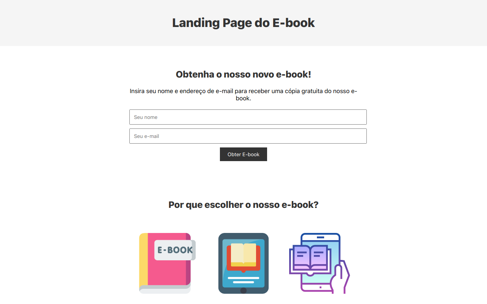

# Modelo de Landing Page para E-book 3

[https://img.shields.io/github/license/leoserrao/landingpage3?style=plastic](https://github.com/leoserrao/landingpage3/blob/main/LICENSE)

https://img.shields.io/github/license/leoserrao/landingpage3?style=flat-square

## Sobre o projeto
Modelo de Landing Page para E-book em HTML, CSS e Javascript.

## Layout Web

## Tecnologia utilizadas
### Front end
HTML5 | CSS | Javascript

## Link do App
https://landingpage-ebook3.vercel.app/
